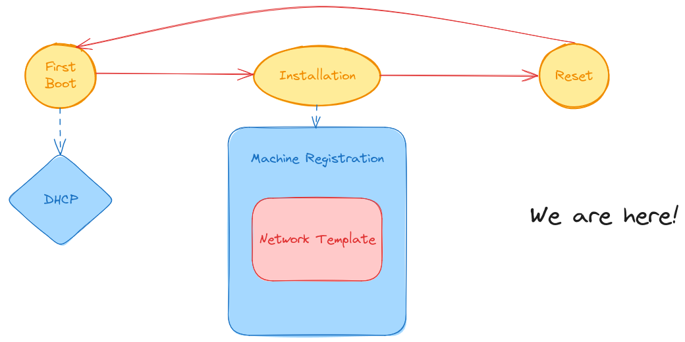
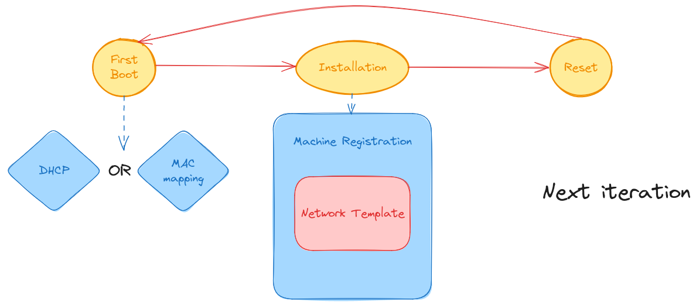
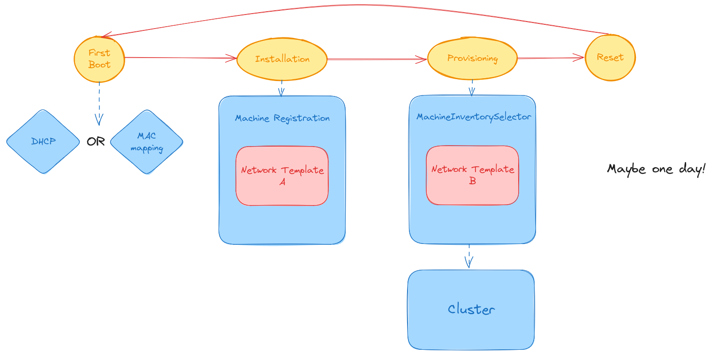

# 2024-07-08 - Elemental Network configuration demo

## Why

### In this demo

1. Assign static IP addresses to K8s nodes.  
1. Mitigate the risk of DHCP as a single point of failure.
1. Remove the need of "infinite leases" when using DHCP.  
1. Provide a way to automatically configure the machine network, bonding, VLANs, etc.

### Not in this demo

1. Allow a complete DHCP-less setup
1. Allow network configuration per cluster (rather than per inventory pool/registration)

## Context

### This demo

  

### Next



### Ideally



## How to run the demo

1. Clone the repositories and the PoC branch

    ```bash
    git clone --single-branch --branch ipam_nmstate_support git@github.com:rancher/elemental-operator.git
    git clone --single-branch --branch ipam_nmstate_support git@github.com:rancher/elemental.git
    ```

1. Setup a full Rancher cluster with the elemental-operator running

    From the `elemental-operator` directory:

    ```bash
    make setup-full-cluster
    ```

    Note this will also include the required `InCluster` CAPI IPAM Provider and the required CAPI IPAM CRDs (not included by Rancher yet). [Reference](https://github.com/rancher/elemental-operator/blob/ipam_nmstate_support/scripts/install-ipam-provider.sh).  

1. Build the elemental-register docker container (to be included in the OS image later)

    From the `elemental-operator` directory:

    ```bash
    make build-docker-register
    ```

1. Build and load an ISO image on the Rancher cluster

    From the `elemental` repository:

    ```bash
    ELEMENTAL_TOOLKIT=ghcr.io/rancher/elemental-toolkit/elemental-cli:nightly make kind-load-dev-iso
    ```

1. Apply the demo manifest and download the live installation media

    Note this manifest assumes a default libvirt network setup for the downstream Elemental nodes (192.168.122.1/24).  
    Please edit the manifest before application to match your needs.

    ```bash
    kubectl apply -f tests/manifests/elemental-dev-example.yaml

    kubectl wait --for=condition=ready pod -n fleet-default fire-img

    wget --no-check-certificate `kubectl get seedimage -n fleet-default fire-img -o jsonpath="{.status.downloadURL}"` -O elemental-dev.x86_64.iso
    ```

    The `elemental-dev.x86_64.iso` can now be booted from any machine.

1. Use the installation media to install an Elemental system  

1. Verify the MachineInventory has a static IP assigned

    ```bash
    kubectl -n fleet-default get machineinventories -o yaml
    ```

    ```yaml
    apiVersion: v1
    items:
    - apiVersion: elemental.cattle.io/v1beta1
    kind: MachineInventory
    metadata:
        annotations:
        elemental.cattle.io/auth: tpm
        elemental.cattle.io/os.cpe-name: cpe:2.3:o:opensuse:tumbleweed:20240605:*:*:*:*:*:*:*
        elemental.cattle.io/os.id: opensuse-tumbleweed
        elemental.cattle.io/os.name: openSUSE Tumbleweed
        elemental.cattle.io/os.pretty-name: openSUSE Tumbleweed
        elemental.cattle.io/os.version-id: "20240605"
        elemental.cattle.io/reg-version: v1.7.0-dev
        elemental.cattle.io/registration-ip: 192.168.122.98
        elemental.cattle.io/resettable: "true"
        creationTimestamp: "2024-07-10T13:08:14Z"
        finalizers:
        - machineinventory.elemental.cattle.io
        generation: 2
        labels:
        element: fire
        elemental.cattle.io/BlockDevicesNumber: "3"
        elemental.cattle.io/CpuTotalCores: "2"
        elemental.cattle.io/CpuTotalThreads: "2"
        elemental.cattle.io/NetIfacesNumber: "1"
        elemental.cattle.io/TotalMemory: "4294967296"
        machineUUID: e5331e3b-1e1b-4ce7-b080-235ed9a6d07c
        manufacturer: QEMU
        productName: Standard-PC-Q35-ICH9-2009
        serialNumber: Not-Specified
        name: test-btrfs-e5331e3b-1e1b-4ce7-b080-235ed9a6d07c
        namespace: fleet-default
        resourceVersion: "8740"
        uid: ad889e8f-c3ad-4d38-9e5f-144803f247c9
    spec:
        ipAddressClaims:
        inventory-ip:
            apiVersion: ipam.cluster.x-k8s.io/v1beta1
            kind: IPAddressClaim
            name: test-btrfs-e5331e3b-1e1b-4ce7-b080-235ed9a6d07c-inventory-ip
            namespace: fleet-default
            uid: 99f7967e-720a-4d03-bef1-5bea76a7b12e
        ipAddressPools:
        inventory-ip:
            apiGroup: ipam.cluster.x-k8s.io
            kind: InClusterIPPool
            name: elemental-inventory-pool
        network:
        connections:
            enp1s0: |
            [connection]
            id=Wired connection 1
            type=ethernet
            interface-name=enp1s0
            [ipv4]
            address1={inventory-ip}/24,192.168.1.1
            dns=192.168.122.1;
            method=manual
            route1=0.0.0.0/0,192.168.122.1
            [ipv6]
            method=disabled
        ipAddresses:
            inventory-ip: 192.168.122.150
        tpmHash: bee315a598cdf3a0c41497b811744a15386fb3b25714dbf61feb034ece5a7668
    status:
        conditions:
        - lastTransitionTime: "2024-07-10T13:09:14Z"
        message: plan successfully applied
        reason: PlanSuccessfullyApplied
        status: "True"
        type: Ready
        - lastTransitionTime: "2024-07-10T13:08:15Z"
        message: NetworkConfig is ready
        reason: ReconcilingNetworkConfig
        status: "True"
        type: NetworkConfigReady
        - lastTransitionTime: "2024-07-10T13:08:15Z"
        message: Waiting to be adopted
        reason: WaitingToBeAdopted
        status: "False"
        type: AdoptionReady
        plan:
        checksum: 44136fa355b3678a1146ad16f7e8649e94fb4fc21fe77e8310c060f61caaff8a
        secretRef:
            name: test-btrfs-e5331e3b-1e1b-4ce7-b080-235ed9a6d07c
            namespace: fleet-default
        state: Applied
    kind: List
    metadata:
    resourceVersion: ""
    ```

1. Verify the MachineInventory is owning the associated IPAddressClaim

    ```bash
    kubectl -n fleet-default get ipaddressclaims -o yaml
    ```

    ```yaml
    apiVersion: v1
    items:
    - apiVersion: ipam.cluster.x-k8s.io/v1beta1
    kind: IPAddressClaim
    metadata:
        creationTimestamp: "2024-07-10T13:08:14Z"
        finalizers:
        - ipam.cluster.x-k8s.io/ReleaseAddress
        generation: 1
        name: test-btrfs-e5331e3b-1e1b-4ce7-b080-235ed9a6d07c-inventory-ip
        namespace: fleet-default
        ownerReferences:
        - apiVersion: elemental.cattle.io/v1beta1
        controller: true
        kind: MachineInventory
        name: test-btrfs-e5331e3b-1e1b-4ce7-b080-235ed9a6d07c
        uid: ad889e8f-c3ad-4d38-9e5f-144803f247c9
        resourceVersion: "8354"
        uid: 99f7967e-720a-4d03-bef1-5bea76a7b12e
    spec:
        poolRef:
        apiGroup: ipam.cluster.x-k8s.io
        kind: InClusterIPPool
        name: elemental-inventory-pool
    status:
        addressRef:
        name: test-btrfs-e5331e3b-1e1b-4ce7-b080-235ed9a6d07c-inventory-ip
    kind: List
    metadata:
    resourceVersion: ""
    ```

1. Verify the Elemental machine is actually using the assigned IP (credentials are `root:root`)

    ```bash
    rancher-15100:~ # ip addr
    1: lo: <LOOPBACK,UP,LOWER_UP> mtu 65536 qdisc noqueue state UNKNOWN group default qlen 1000
        link/loopback 00:00:00:00:00:00 brd 00:00:00:00:00:00
        inet 127.0.0.1/8 scope host lo
        valid_lft forever preferred_lft forever
        inet6 ::1/128 scope host noprefixroute 
        valid_lft forever preferred_lft forever
    2: enp1s0: <BROADCAST,MULTICAST,UP,LOWER_UP> mtu 1500 qdisc pfifo_fast state UP group default qlen 1000
        link/ether 52:54:00:45:14:c5 brd ff:ff:ff:ff:ff:ff
        inet 192.168.122.150/24 brd 192.168.122.255 scope global noprefixroute enp1s0
        valid_lft forever preferred_lft forever
    ```

1. Verify the NetworkConfig yip applicator is writing the expected nmconnection file

    ```bash
    rancher-15100:~ # cat /oem/94_custom.yaml 
    name: Apply network config
    stages:
        initramfs:
            - files:
                - path: /etc/NetworkManager/system-connections/enp1s0.nmconnection
                permissions: 384
                owner: 0
                group: 0
                content: |
                    [connection]
                    id=Wired connection 1
                    type=ethernet
                    interface-name=enp1s0
                    [ipv4]
                    address1=192.168.122.150/24,192.168.1.1
                    dns=192.168.122.1;
                    method=manual
                    route1=0.0.0.0/0,192.168.122.1
                    [ipv6]
                    method=disabled
                encoding: ""
                ownerstring: ""
            if: '[ -f /run/elemental/active_mode ]'
    ```

1. Trigger a Machine reset

    ```bash
    kubectl -n fleet-default delete machineinventories --all
    ```

    You can suppress the scheduled shutdown on the machine with `shutdown -c` if you want to inspect the state.
    At this stage you will notice that: 

    1. The MachineInventory and all associated IPAddressClaims have been deleted on the Rancher cluster.
    2. The machine reverted to the initial network configuration (dhcp):  

        ```bash
        elemental:~ # ip addr
        1: lo: <LOOPBACK,UP,LOWER_UP> mtu 65536 qdisc noqueue state UNKNOWN group default qlen 1000
            link/loopback 00:00:00:00:00:00 brd 00:00:00:00:00:00
            inet 127.0.0.1/8 scope host lo
            valid_lft forever preferred_lft forever
            inet6 ::1/128 scope host noprefixroute 
            valid_lft forever preferred_lft forever
        2: enp1s0: <BROADCAST,MULTICAST,UP,LOWER_UP> mtu 1500 qdisc pfifo_fast state UP group default qlen 1000
            link/ether 52:54:00:45:14:c5 brd ff:ff:ff:ff:ff:ff
            inet 192.168.122.98/24 brd 192.168.122.255 scope global dynamic noprefixroute enp1s0
            valid_lft 3574sec preferred_lft 3574sec
            inet6 fe80::652c:355f:d282:633a/64 scope link noprefixroute 
            valid_lft forever preferred_lft forever
        ```

    Upon a `reboot` the machine should start in recovery mode to perform the actual reset and once again ask for a new static IP address
    and use it as it was done after installation.
